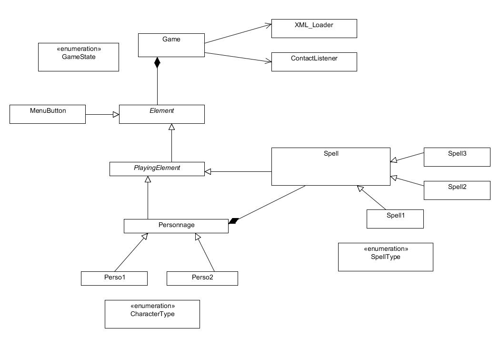
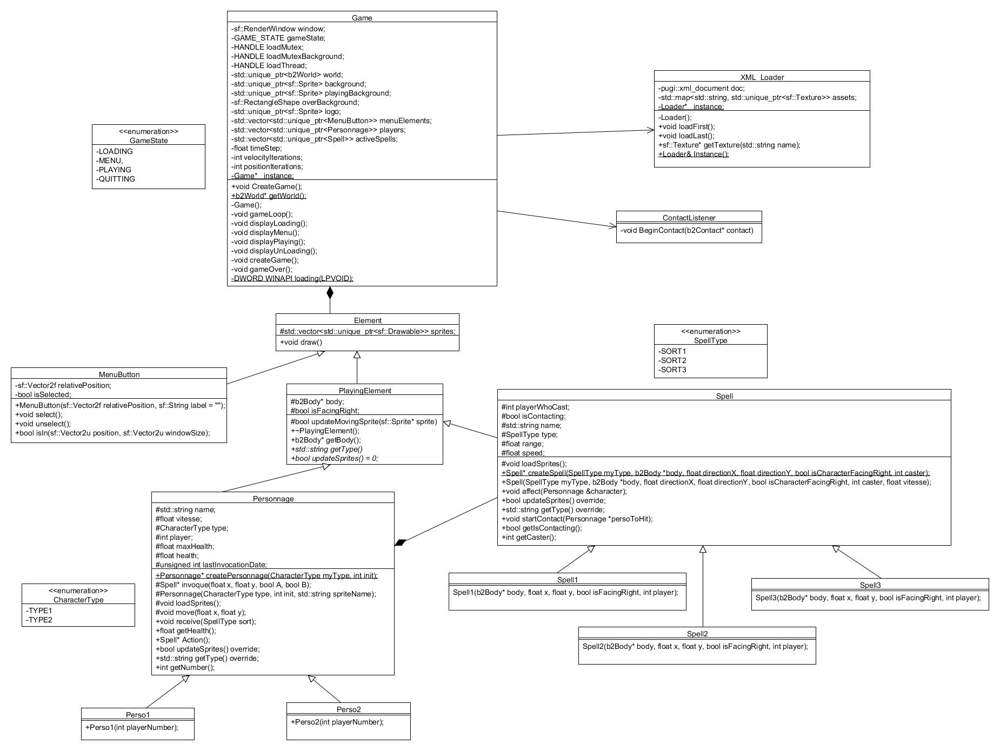

# ProjetIOOI
Mini-projet d'un jeu en C++ réalisé en fin de 2ème année d'école d'ingénieur par Gaëlle CLAVELIN et Euryale AMBROISE.  
Ce projet à été développé à partir d'un sujet imposé : |00|  
A partir de là il nous est apparu que ce sujet pouvait représenter deux sorciers se battant avec leur baguette magique et nous avons donc décidé de faire un jeu de combat de sorciers en 2D en nous inspirant de jeux comme Street Fighter.   

## Les contraintes de l'exercice
Les contraintes de l'exercices nous imposaient de développer ce jeu en C++ sans avoir recourt à des moteurs tout fait (type Unreal). De plus nous devions utiliser trois bibliothèques parmis la liste qui nous étaient fournie. Nous avons donc décidé d'utiliser les bibliothèques suivantes : 
* SFML : Librairie libre de gestion de fenetres et de dessin
* Box2D : gestionnaires de collisions
* pugixml : Librairie de gestion de fichiers XML

Par ailleurs nous devions réaliser le projet en 2 semaines.

## Le résultat
Au bout des deux semaines, nous sommes relativement fier de ce que nous avons accompli. Nous avons un jeu jouable, avec 2 personnages et 3 sorts différents. Le jeu est parfaitement fluide et se joue a la manette.  
Voici quelques captures d'écran : 
   

* Le menu du jeu

Pour le moment les parties ne sont pas paramétrables, c'est un défaut que nous corrigerons par la suite. Cela étant le menu fonctionne aussi bien avec la souris qu'avec la manette.

   

* Le jeu en pleine partie 

Le jeu est donc une sorte de Street Fighter sauf que les personnages sont des sorciers qui ne lancent que des sorts à distance. Pour le moment les personnages ne disposent que de 3 sorts ayant une puissance et une vitesse différentes. Les deux personnages aussi ont des caractéristiques différentes (points de vie et vitesse de déplacement).  
S'il n'y a qu'un seul joystick de connecté, le second personnage est controlable au clavier. S'il n'y a aucun joystick, c'est le premier personnage qui devient controlable au clavier.

   

* Le game over

L'affichage du Game Over est a revoir mais à l'avantage d'indiquer clairement que le jeu est terminé.

   

## La réalisation 

   

* Le jeu en pleine partie 

   

* Le game over

   